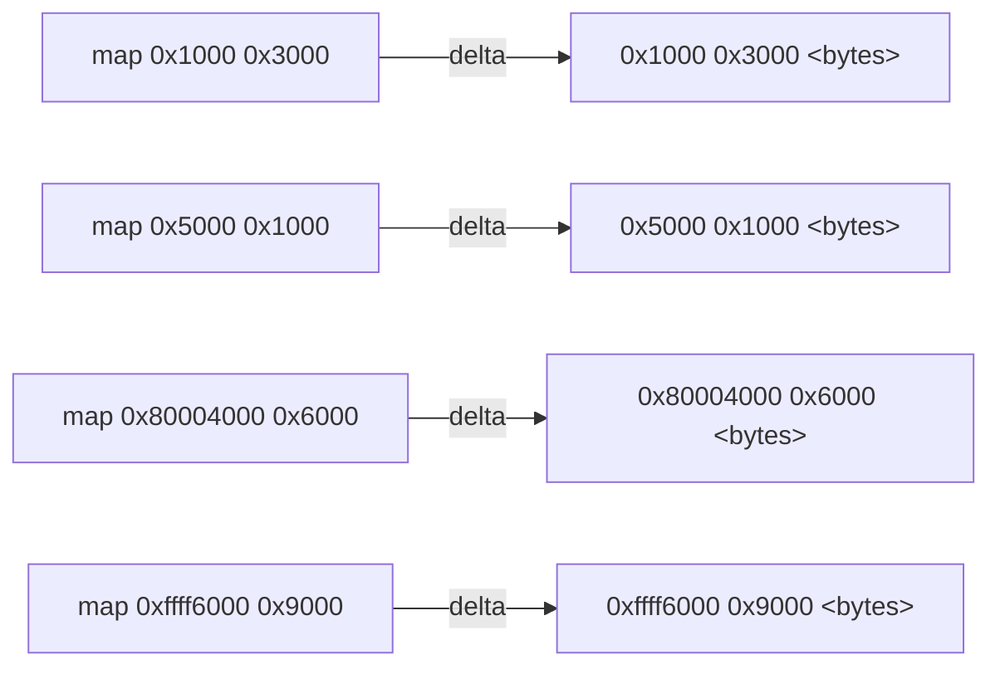
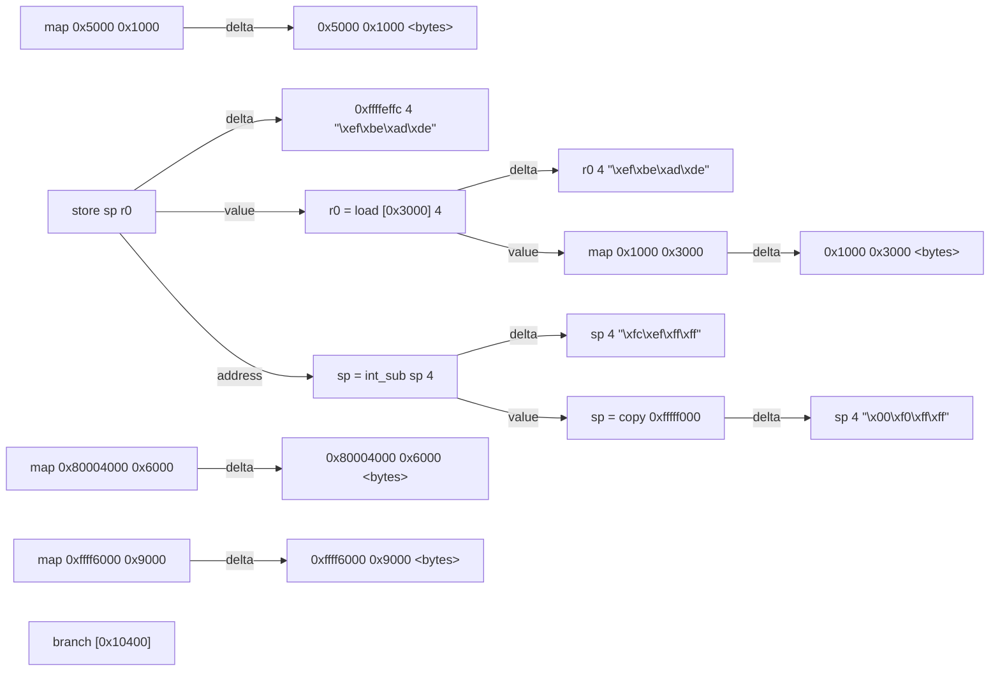
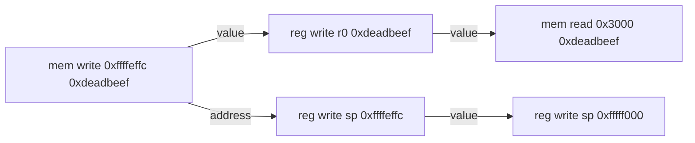
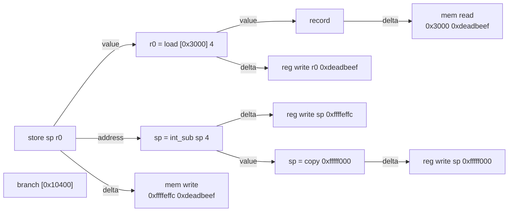
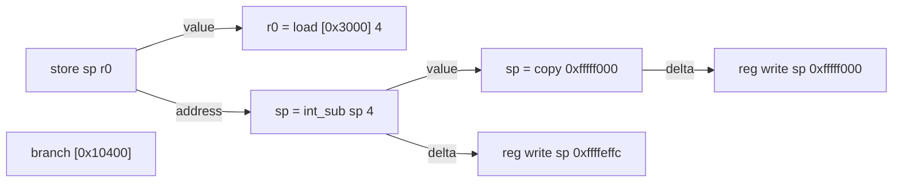
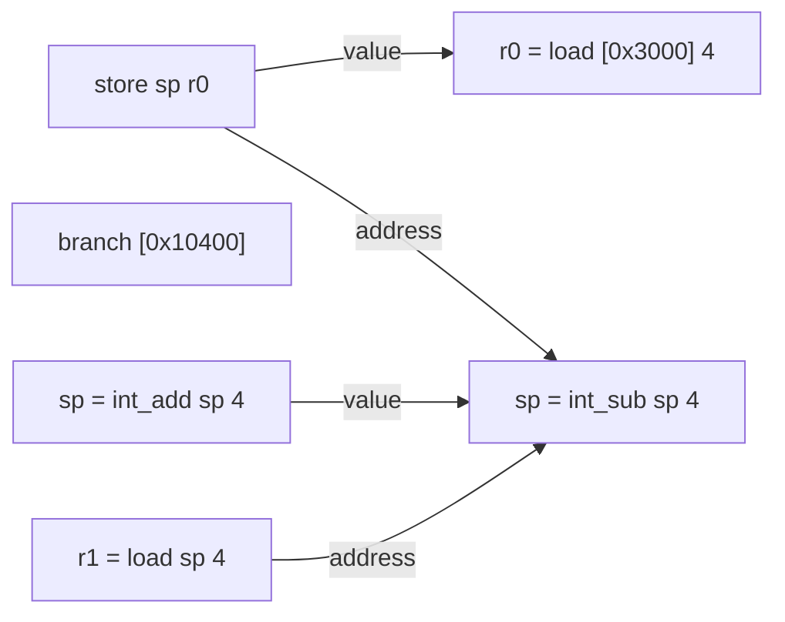

# Dynamic Dataflow

Dynamic Dataflow is the name of one of the core analyses used to enrich program execution traces. The primary goal of this analysis is to relate the effects of an instruction with previous instructions that operate on the same data. This document will attempt to illustrate how this is performed in a few different ways in order to develop an intuitive understanding of the resulting graph.

Note that the graphs described in this documentation are simplified versions of the graphs produced by this analysis for illustrative purposes. For the full schema of the graphs our analysis produces, see our [schema page](database/schema.md).

## Sources and Flows

If you consider a generic program, all data operated on by the program originates from one of two primary categories: intrinsic data that is present in the program at the onset of execution and extrinsic data that is provided to the program by its environment. Together, these categories constitute the _sources_ of data for a program. For the graph we are describing, all data is produced or transformed via the execution of an _operation_. Thus, _sources_ of data within the graph are identified by the execution of an _operation_ without any outgoing _dependency edges_. Let us walk through a couple of common examples to see how this works in practice.

### Intrinsic Sources and a Simple Graph

In a standard, userland program running on modern, general-purpose operating system, intrinsic data for a given execution is easily identified. At the point in which the program has been loaded by the operating system, the value of each byte located at each addressed mapped into memory is an intrinsic source of data. Within our execution model, an _operation_ can only produce a single, contiguous effect in a program; so, the intrinsic sources of data in this userland program we are describing can be modeled as such:

A program with the following memory map:

```
00001000-00004000 /usr/bin/prog
00005000-00006000 [heap]
80004000-8000a000 /usr/lib/lib.so
ffff6000-fffff000 [stack]
```

Could produce the following graph:



As soon as the program starts executing instructions, additional _operations_ will be added to the graph and many of those will operate on these _sources_ of data. For example:

The following program:

```
0x1000: mov sp, 0xfffff000
0x1004: mov r0, [0x3000]
0x1008: push r0
0x1008: jmp 0x10400
```

May produce the following graph:



At this point, we now see _operations_ that are not _sources_ themselves, but operate on the intrinsic data provided by a _source_. When these are added to the graph, they often generate _dependency edges_. A _value dependency edge_ is generated when an _operation_ uses the value produced by a previous _operation_ to produce its own value. As seen in the example, when the instruction `mov r0, [0x3000]` is executed it generates the _operation_ `r0 = load 0x3000 4` which loads four bytes from the address `0x3000` and stores them in the register `r0`. The values that were present at that location in memory were produced by the _operation_ `map 0x1000 0x3000` (i.e. map `0x3000` bytes into memory starting at `0x1000`), so a _value dependency edge_ is created between those two operations. In this case, the value located at that address in memory is known, so we know what the resulting value is that will be stored in register `r0`. However, even if this value was unknown (e.g. not captured in the trace), we would know that whatever the result of the `load` operation was would still depend on the output of the `map` operation, so we can still generate a `value dependency edge`.

The other edge you see in this graph is an `address dependency edge`. These edges are generated between an indirect memory operation and the operation(s) that were used to compute the address. For example, the `push r0` instruction generates a `store sp r0` operation. This operation writes the value stored in register `r0` to the address stored in `sp`. There is a `value dependency edge` between `store sp r0` and `r0 = load 0x3000 4` because the value that is stored in memory depends on the value written in `r0`. However, there is also an `address dependency edge` generated between `store sp r0` and `sp = int_sub sp 4`, because the memory address that is written to depends on the value that is stored in the `sp` register.

### Extrinsic Sources and Potential Inaccuracies

Finally, let us cover extrinsic data sources. Extrinsic sources tend to be more varied than intrinsic data sources. No matter what platform your program is running on, almost all intrinsic data can be defined by the state of memory at the start of execution. The type of extrinsic sources that appear in your trace, on the other hand, are dependent on the platform on which your program is running. Taking a userland Linux program as an example, the extrinsic sources of data primary come from `syscalls` and shared memory regions. For embedded systems, on the other hand, extrinsic data sources could be memory-mapped IO or special IO instructions. Regardless of the source, these are often the most unreliable to capture in traces and tend to result in mistakes in the graph. To see why, let us imagine we are tracing a userland Linux program using `qemu-user`. This tracing backend functions by starting a small CPU emulator and translating each `syscall` that the guest makes into the equivalent `syscall` on the host. With that in mind, consider the following code:

```
mov [0x1000], esi
mov eax, 0x3
int 0x80
mov esi, [0x1000]
```

This code stores the value of the `esi` register in memory at address `0x1000`, executes the `read` `syscall`, and then loads the value at memory `0x1000` back into register `esi`. Because we are tracing with `qemu-user` we are unable to observe all the instructions that were executed in the kernel to carry out this `syscall`, so when control is returned to the program, the trace simply picks up the next instruction in userland as if no other instructions occurred between them.

The resulting operations that are created may look something like this:

```
store [0x1000] esi
eax = copy 0x3
call_other "int"
esi = load [0x1000] 4
```

Due to the implementation details of the `qemu-user` trace tool, the trace will often still have records for all of the registers that changed, but it will _not_ be able to determine what memory may have been affected by the `syscall`. If the `syscall` wrote to memory at address `0x1000` a `value dependency edge` may be created between the `store` operation and the previous `load` operation even though the edge _should_ be between the `load` operation and the `call_other` operation. This type of mistake occurs when we have not provided _dataflow models_ for the extrinsic sources of data.

### Flows

We generally refer to a particular path or subgraph as a _flow_. _Flows_ can be used to answer a number of questions. Given an operation that produces a specific delta (e.g. the operation that wrote "0xdeadbeef" into memory), we can trace a _flow_ backwards to discover why a particular value was written to a particular location. This can answer coarse grain questions such as: "assuming I am able to influence a `read` call, does my data flow into this `store` operation?" This is usually referred to as taint analysis. We can also be a little more fine grained and focus on _which kind_ of operations flowed into a specific operation. By doing this, we can build an _abstract syntax tree_ of operations used to compute the value produced by a particular operation to study _how_ a value was produced via a mathematical expression. This is not quite as powerful as techniques such as _symbolic execution_ which can answer questions such as "what else could the program have done," but it is still a valuable primitive for reverse engineering deep spots in a program.

The last thing that we will cover in this section is how _flows_ end. Sometimes two distinctly different _flows_ of data occupy the same space at different times in a program. In memory, this is easily identifiable as a `store` operation may replace the existing _flow_ at that memory address. If the previous _operation_ that affected the memory address in question has no incoming dependency edges, the previous _flow_ can be considered terminated. This is also true of registers; however, there are a couple of other tricky ways that a _flow_ can terminate in registers. There are some _operations_ that logically clear or set a register without any influence from the notional inputs to the _operation_. For example the instruction `xor eax, eax` should notionally produce a `eax = int_xor eax eax` operation; however, semantically this instruction is meant to clear the value stored in `eax` regardless of its previous value, so instead a `eax = copy 0` operations is emitted no `value dependency edge` is produced. There are a number of different variations of this, and it is mathematically infeasible to determine whether or not the input value _truly_ has any bearing on the value produced by the operation. So, we will only terminate a _flow_ at an operation if we can determine that the operation has a constant output based solely on the target operation with no other context. At the moment, the following heuristics are preformed:

- Irrefutable comparisons (i.e. `x = int_{cmp} y y`, where `cmp` is any variation of comparison)
- Clear operations
    - `x int_sub y y`
    - `x {bool,int}_xor y y`
    - `x {bool,int}_and y 0`

## Trace Enrichment

In the previous section, we framed our analysis from a data-oriented point-of-view. We claimed that programs are made up of discrete pieces of data that are transformed as they flow out through operations. In this section, we are going to frame this analysis as an enrichment of a program execution trace. If we view a program execution trace as a partially ordered sequence of events that modify the state of a program, the graph that we build upon this trace enriches the trace by imposing additional binary relations on these events. The _value dependency edge_ as described above, is a binary relation on operation events within the trace that maps an operation to the most recent operation in the sequence whose output overlaps with an input of the target operation. An _address dependency edge_ has a similar definition with the exception that it is only generated for inputs that represent an indirect access (e.g. load memory from this address, store memory to this address).

To describe how this may be performed, we will build the graph using two different models for a program execution trace. These models do not present a practical difference between each other; however, multiple perspectives may be enlightening for the development of new tracing backends.

### Record-First Model

In the record-first model of a program, a trace is simply a series of "modifications" to program state. If one were to pause a program after each instruction and record the difference of all observable state, this would be equivalent to the record-first trace model. To illustrate this, let us consider the following program:

```
0x1000: mov sp, 0xfffff000
0x1004: mov r0, [0x3000]
0x1008: push r0
0x1008: jmp 0x10400
```

If one were to produce a trace for this program, it may look something like:

```
reg write sp 0xfffff000
mem read 0x3000 0xdeadbeef
reg write r0 0xdeadbeef
mem write 0xffffeffc 0xdeadbeef
reg write sp 0xffffeffc
```

A couple things to take note here, as mentioned previously a trace is a _partially ordered_ sequence. Some events may occur at precisely the same point in hardware and some events may be present in a different ordering depending on the tracing backend that is used. For most of the tracing backends, events that occur during the execution of a single instruction (for a single-threaded program) have a partial ordering, and instructions themselves have a total ordering. In either case, a correct analysis ensures that program state is consistent at instruction boundaries given the partially ordered set of records.

The graph we would _like_ to generate from this trace would look something like:



Unfortunately, without additional information, there is too much ambiguity as to how these records are even related. With a bit more information, we can clear up this ambiguity.

```
reg write sp 0xfffff000
ins mov sp, 0xfffff000
mem read 0x3000 0xdeadbeef
reg write r0 0xdeadbeef
ins mov r0, [0x3000]
mem write 0xffffeffc 0xdeadbeef
reg write sp 0xffffeffc
ins push r0
ins jmp 0x10400
```

The records alone give us an idea of _what_ happened; by adding the instruction records, we determine _why_ or _how_ the events occurred, which is necessary for generating the edges we want. We break the instructions into their microcode in order to attribute records to the operations that caused them:

```
reg write sp 0xfffff000
ins mov sp, 0xfffff000
  op sp = copy 0xfffff000
mem read 0x3000 0xdeadbeef
reg write r0 0xdeadbeef
ins mov r0, [0x3000]
  op r0 = load [0x3000] 4
mem write 0xffffeffc 0xdeadbeef
reg write sp 0xffffeffc
ins push r0
  op sp = int_sub sp 4
  op store sp r0
ins jmp 0x10400
  op branch [0x10400]
```

Which gives us the graph:



At this point we have our complete graph. The only new thing to note here is that because _dependency edges_ are drawn between operations, we occasionally need to insert a "fake" operation that attests some attribute of program space (in this case `0xdeadbeef` is stored at memory address `0x3000`) when a record does not have a corresponding operation.

### Instruction-First Model

The instruction-first model is very similar to the record-first model except that instead of using instructions to assert binary relations between program changes, we use records to enrich the graphs formed by sequences of instructions. In this model, a program execution trace is simply a sequence of instructions executed by the program. Looking at the same program as the previous section, we have the following trace:

```
ins mov sp, 0xfffff000
ins mov r0, [0x3000]
ins push r0
ins jmp 0x10400
```

Without any additional information, we can generate the following graph:



This is actually a pretty good start. Without ever knowing the initial state of the program, we can still build up a pretty accurate graph of how data flows throughout a program. Unfortunately, if one were to search the graph for a particular value and track its flows, this graph would not provide a lot of help. Sometimes, constant values that are derived from the instructions themselves can be used to attest particular regions of program state; however, this does not generally represent the majority of data in a program. This effect is compounded under operations that perform indirection. When the value of an address cannot be derived given our current knowledge of program state, entire flows are terminated. For example, let us consider a slightly shifted window of our program:

```
ins mov r0, [0x3000]
ins push r0
ins jmp 0x10400
ins pop r1
```

This sequence of instructions results in the following graph:



As you can see, this is a significantly less useful graph. Now we do not have any deltas so we do not know the value of any register or memory, and because we do not know the value of the `sp` register we are unable to determine that was stored during the `push r0` instruction is the same value that is loaded during the `pop r1` instruction. Naively, one could infer that, because the value of the `sp` register does not change between the `store` and `load` operations, the value loaded from memory at `sp` _must_ flow from the value stored in the previous instruction. Generally speaking, that would be an unsound assumption. This is because some other variable may be aliasing the same region of memory, thus accesses through that variable would correctly disrupt the flow of data between the `push` and `pop` pair. In this trivial example, that does not happen. However, to prove this more generally is computationally infeasible.

We bypass these challenges in our analysis by maintaining concrete program state, which is provided by memory and register records. These registers allow our analysis to compute intermediate values required for building the graph. In a perfect world, we could simply emit records for the entire initial state of the program rather than distributing records throughout the trace. However, there are many points in a program that produce data not associated with any observed instruction (e.g. `syscalls`, shared memory, etc.). By distributing records throughout the trace, our analysis can recover from external events and potential mistakes in implementation.

## Last Modified Table

Our implementation of this analysis revolves around a core lookup table called the "last modified" table. This table maps abstract byte addresses to an optional last modified index and optional last known value (i.e. `(space_index: u16, space_offset: u64) -> (last_index: Option<u64>, last_value: Option<u8>)`). An address, in this scheme, is an offset to a byte in abstract memory space. What a space is depends on the platform being analyzed, but in general, most platforms will have a space for memory as well as a space for registers. In the context of a trace of multiple threads, there may be a single memory space and multiple register spaces to track the flow of data between threads. In the context of a trace of multiple processes, there may be multiple memory spaces and multiple register spaces. This has not been extensively tested and requires custom handling for platform information such as shared memory mappings and other high-level concepts that may alter the dataflow graph.

When modeling an operation, all input variables will be collected and resolved via the "last modified" table. Thus, for each input to an operation, the model will have available every byte value that is known and the last operation that produced that value (if known). For some operations (e.g. integer arithmetic), if there are any unknown values in the input, the model does not attempt to produce a value and instead marks all of the bytes in the output as unknown. For other operations (e.g. integer logic), the model can produce partially known output values with holes for unknown values. In either case, the indices for the last operations that wrote to the respective inputs are combined and used to generate dependency edges (value or address depending on the context). When the operation is finally committed, the last modified table is updated with the newly produced value (known or unknown) and the index of the newly committed operation. Occasionally, a trace will contain records that dispute the results of models or the state of the "last modified" table. In these cases, an additional operation is generated that replaces the value found in the table with the one found in the record and a dependency edge is generated between the new operation and the operation previously marked as the last index. This may result in over estimations of flow; however, these speculative dependency edges can be pruned during traversal of the graph by ending the walk when you encounter the special operation used for correcting values.
